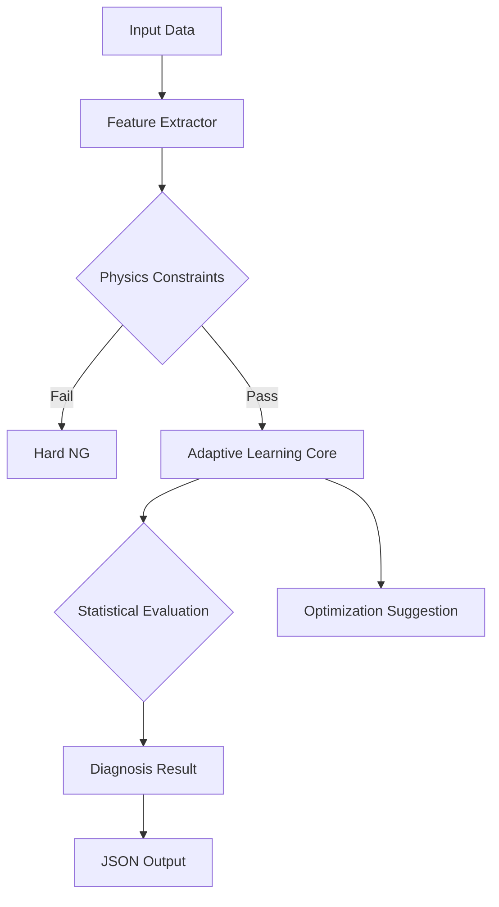

# APSD: Adaptive Physics-based Screwing Diagnostic System

APSD is a robust SDK for industrial fastening diagnostics, designed to run on Edge devices (e.g., Raspberry Pi). It combines **Physical Constraints** (Heuristic) and **Adaptive Statistical Learning** (AI) to provide accurate, self-evolving quality control.

## Features

*   **Modular Architecture**: Core logic, models, and storage are separated.
*   **Dual-Layer Diagnosis**:
    *   **Layer 1**: Hard Physical Constraints (VDI 2647 compliant).
    *   **Layer 2**: Adaptive Learning with Rolling Buffer (Welford's Algorithm).
*   **Resilient Storage**: Atomic writes for data safety on power loss.
*   **Edge Optimized**: Lazy loading and memory-efficient data structures.
*   **Production Ready**: Configuration via YAML, customizable tolerances.

## Quick Start

### 1. Installation

Requires Python 3.10+.

```bash
# Create virtual environment
python -m venv .venv
source .venv/bin/activate  # or .venv\Scripts\activate on Windows

# Install dependencies
pip install -r requirements.txt
```

### 2. Basic Usage

```python
from apsd import APSDiagnosticSystem

# Initialize SDK
sdk = APSDiagnosticSystem(config_path="configs/default_config.yaml")

# Diagnosis
result = sdk.diagnose(carrier_id="CARRIER_001", data={
    "Hole_1": {
        "torque": [0.0, 0.5, ... 5.0],
        "angle": [0.0, 1.0, ... 360.0],
        "time": [0.0, 0.01, ... 2.0]
    }
})

print(result["Hole_1"]["screw_issue"]["status"]) # OK/NG
```

## Model Management

The SDK handles model persistence automatically to ensure data safety and continuity.

### Saving & Loading
- **Automatic Loading**: When `diagnose(carrier_id=...)` is called, the system checks `saved_models/{carrier_id}.json`. If found, it loads the history (Rolling Buffer, Golden Base).
- **Atomic Saving**: Models are saved using an atomic write strategy (write to temp -> rename) to prevent data corruption during power loss.
- **Manual Save**: You can trigger a save manually if needed (e.g., before shutdown).

```python
sdk.save_models() # Saves currently active carrier models to disk
```

## Diagnostics & Standards

The system fuses physical heuristic rules with statistical learning.

### Physical Standards
| Standard | Metric | usage |
| :--- | :--- | :--- |
| **VDI/VDE 2647** | **Rigidity Slope (dT/dθ)** | Used to detect "Snug Point" and structural integrity. Violations (e.g., Negative Slope) trigger immediate NG. |
| **ISO 16047** | **Energy (∫Tdθ)** | Used for "Total Work" calculation. Detects material anomalies (e.g., missing variations) that torque alone misses. |

### E-Code & R-Code Reference
The system outputs standardized codes for integration with MES/SCADA systems.

| E-Code | Description | Category | Recommended Action (R-Code) |
| :--- | :--- | :--- | :--- |
| **E02** | Torque Anomaly (High/Low) | Tool/Setting | **R02**: Check Tool Settings / Torque Program |
| **E04** | Rigidity Slope Anomaly | Carrier/Part | **R04**: Check Screw Thread / Fixture Rigidity |
| **E08** | Work/Energy Anomaly | Material | **R08**: Check Washer / Gasket Presence |
| **DRIFT_DETECTED** | Concept Drift (Aging) | Process | **UPDATE_PARAM**: Apply suggested optimization parameters |
| **E_NEG_SLOPE** | Physics Violation (Neg Slope) | Physical | **R_CHECK_FIXTURE**: Inspect fixture for slippage |

### Optimization Feedback (Requirement 13)
When the system detects statistical drift or instability, it provides specific closed-loop feedback in the `optimization_suggestion` field:
- **Torque**: Suggested % adjustment (e.g., `+5.0%`, `-8.0%`) to recenter the mean.
- **Speed**: Suggested step down (e.g., `-10%`) if variance is high.

```json
"optimization_suggestion": {
  "status": "OPTIMIZE",
  "e_code": "DRIFT_DETECTED",
  "params": {
    "suggested_torque_adjustment_percent": -8.0,
    "suggested_speed_adjustment_percent": -10
  }
}
```


## System Architecture



## Configuration (configs/default_config.yaml)

```yaml
tolerance:
  production_tolerance_factor: 3.0  # Adjustable sigma (0.5 - 5.0)

codes:
  disabled_e_codes: []
  disabled_r_codes: []
```

## Development

### Verification & Testing Suite

The `tests/` directory contains tools for verification, data simulation, and integration testing.

#### 1. Integration Tests (`tests/test_integration.py`)
This is the primary verification suite. It simulates the full lifecycle of the system:
- **Cold Start**: Verifies initial state handling.
- **Shadow Mode**: Checks transition logic (N < 50).
- **Golden Base**: Confirms baseline locking (N = 100).
- **Anomalies**: Tests detection of physical (Slope) and statistical (Torque) issues.
- **Concept Drift**: Simulates tool aging.

**Usage:**
```bash
python -m pytest tests/test_integration.py
```

#### 2. Scene Data Generator (`tests/data_generator.py`)
A utility module to generate synthetic torque/angle curves for various scenarios.
- `normal`: Standard S-curve.
- `loose`: Low torque/slope (e.g., stripped screw).
- `drift`: Subtle increase in torque (simulating aging).
- `hard_ng_slope`: Negative slope (physical violation).

**Usage (Python):**
```python
from tests.data_generator import generate_fastening_curve
data = generate_fastening_curve("normal")
```

#### 3. Specific Verification (`tests/verify_specific_case.py`)
A script to verify specific custom scenarios or carrier payloads (e.g., `CARRIER_2026_001`). It demonstrates how to manually feed data dictionary structures into the SDK and print the results.

**Usage:**
```bash
python tests/verify_specific_case.py
```

### Build Wheel
```bash
python setup.py bdist_wheel
```

## Folder Structure
*   `apsd/`: Source code.
*   `configs/`: Configuration files.
*   `tests/`: Unit and integration tests.
*   `examples/`: Demo scripts.
*   `saved_models/`: Serialized model files (JSON).

## License

This project is licensed under the **MIT License**. See the [LICENSE](LICENSE) file for details.

Copyright (c) 2026 **Ray9453**

## AI Collaboration Statement

This is an open-source project collaboratively developed with **Google Gemini AI**.

The project's code architecture, core logic, and optimization suggestions were primarily generated by **Google Gemini**, with final testing, adjustments, and integration performed by human developers. This demonstrates the high efficiency and potential of AI-human collaboration.

## Credits

*   **Architect & Lead Developer**: [Ray9453](https://github.com/Ray9453)
*   **Co-Developer**: Google Gemini AI
*   **Contributors**: Open Source Community

---
*Generated by APSD Dev Team & Google Gemini*
